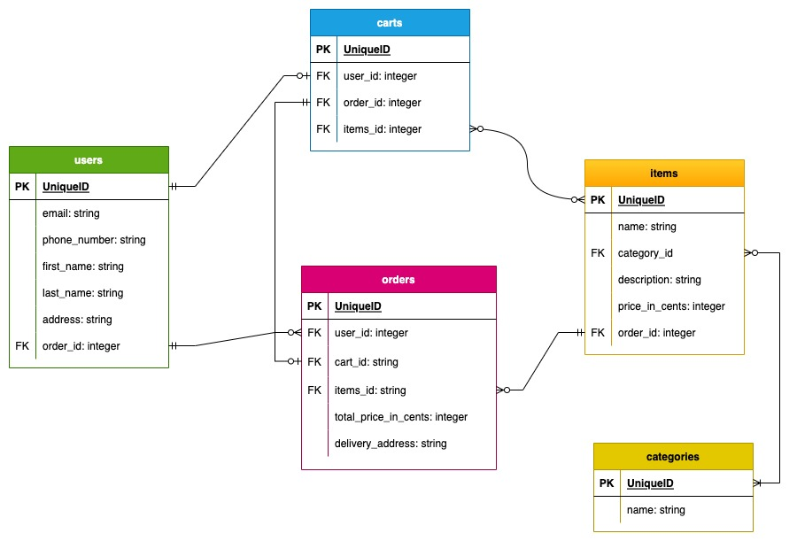

# Boilerplate NodeJS TypeScript Backend set up

[Node.js Backend Project Setup with Typescript, ESLint, Prettier, and Jest](https://www.youtube.com/watch?v=BKz7rnbQyK4&ab_channel=LeoRoese)
14,667 views, uploaded on Mar 15, 2021
hjj
Finished boilerplate

Next step:

- Set up express, graphql
- resolver, mutation
- deploy to herokuhjkhjk
- add authentication

## Machi Ramen ERD



GraphQL setup:
<https://www.howtographql.com/typescript-apollo/1-getting-started/>

## Commands

- `yarn generate` to update your `schema.graphql` and `nexus-typegen.ts` file when there are any changes in your Nexus code.
- `yarn dev` to run server with nodemon.
- If want to use same `dev` script as in howtographql to start the web server and watch for any changes:
  - Add this to package.json scripts:

    ```bash
    "dev": "ts-node-dev --transpile-only --no-notify --exit-child src/index.ts",
    ```

  - Yarn install ts-node-dev
  - Then run server with the new `yarn dev`

### Prisma

After changing schema.prisma, we need to create migration to change our database by running:

```bash
prisma migrate dev --name <migration-message>
# e.g: prisma migrate dev --name added_job_title
```
